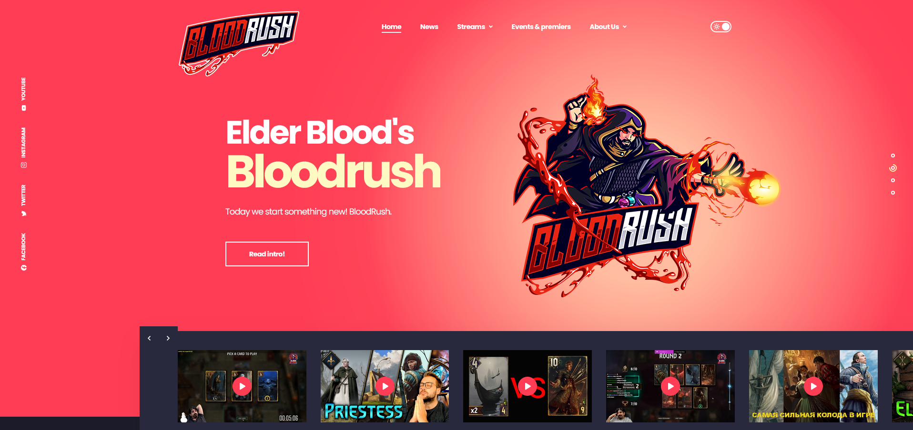
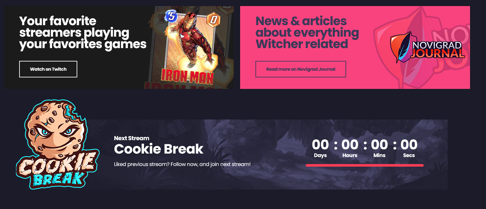

## Description

Bloodrush.com website (Wagtail + Django + Python). Uses Tailwind.
News page about gaming, Cookie Break podcast, Team Elder Blood streamers, events & more.


Running here: https://bloodrush.gg

## Features

- News
- Streams/streamers
- Events & premiers
- About Us
- Sliders
- Countdown
- and more


## Screenshots

Main slider (news or custom content)


Podcast promo


Banners


Countdown till next podcast


## Roadmap

- Filling with new content
- Linking podcast episodes
- Adding news series
- Testing


## Deployment and running

Clone the project.

Go to the project directory and activate environment

```bash
  cd EsportCenter
  source env/bin/activate
```

Install dependencies

```bash
  pip install -r requirements.txt
```

Creates the migrations file.
```bash
  python manage.py makemigrations
```

Executes the migrations and updates the database with your model changes.
```bash
  python manage.py migrate
```

Start the server

```bash
  python manage.py runserver
```


Wagtail update

```bash
  pip install wagtail==new_version_number
```


## Useful links
 - [Bloodrush](https://bloodrush.gg)
 - [Wagtail](https://wagtail.org/)


